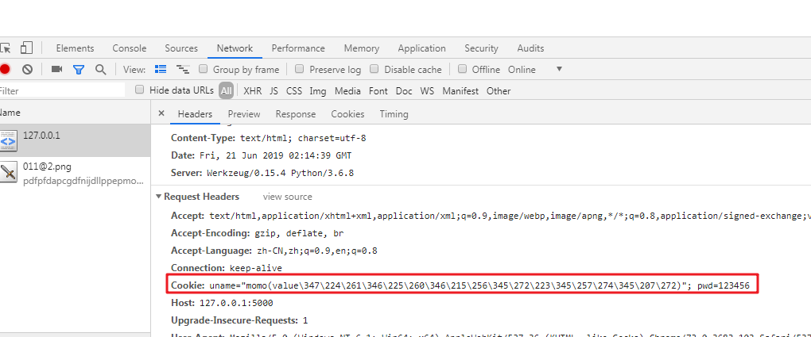

# Flask高级01


## Cookie(存储于客户端)

### 基本概念

​	在网站中，http请求是无状态的。也就是说即使第一次和服务器连接后并且登录成功后，第二次请求服务器依然不能知道当前请求是哪个用户。

​	 cookie的出现就是为了解决这个问题，第一次登录后服务器返回一些数据（cookie）给浏览器，然后**浏览器保存在本地**，当该用户发送第二次请求的时候，就会自动的把**上次请求存储的cookie数据自动的携带给服务器**，服务器通过浏览器携带的数据就能判断当前用户是哪个了。

​      但是cookie**存储大小是有限的**，不同的浏览器有不同的存储大小，但一般**不超过4KB**。因此使用cookie只能存储一些小量的数据。

#### cookie的工作原理


### Cookie的有效期

#### 默认有效期

服务器可以设置cookie的有效期，以后浏览器会自动的清除过期的cookie，**默认有效期是cookie将会在浏览器关闭后过期。**

#### 查看cookie有效期的方法

##### 方法一：借助页面上的开发工具


##### 方法二：域名前小！号（不推荐，因为有缓存影响）


##### 方法三：结合浏览器上的内容设置。


#### 设置cookie有效期的方法

##### 方式一：max_age

​	max_age=以秒为单位【距离现在多少秒后cookie会过期】

```python
resp.set_cookie('uname','momo',max_age=60 )# 3天免登录   max_age=60*60*24*3
```

##### 方式二：expires

​	expries的有效期是用的**datetime格式**，并且采用的是*格林尼治时间*，**比北京时间+8小时。**

```python
# 引入datetime模块

from datetime import datetime

# 规定过期时间，注意相对啊来说，+8小时才是北京时间。

ex = datetime(year=2019 ,month=7,day=21,hour=3,minute=20,second=0)

# 设定有效期

resp.set_cookie('uname','momo',expires=ex)
```

###### 开发时候的实际写法

​	在开发的时候不能把有限期写死，所以要导入一个timedelta模块。

```python
# 表示现在的时间+30天。也就是有效期30天。

ex2 = datetime.now()+timedelta(days=29,hours=16)

resp.set_cookie('uname', 'momo', expires=ex2)
```

### 注意

-   max_age在IE8以下的浏览器是不支持的
-   虽然expires在最新版的HTTP协议中废除了，但是所有的浏览器都可以支持，假如要使用IE8以下的浏览器，就是用expires。

### Flask设置删除cookie

#### 设置cookie

>   格式：resp.set_cookie(‘key’,'value')

​	key 和value 是从数据库中拿出来的。

#### 查看cookie信息

##### 方式一：借助页面上的开发工具进行查看



##### 方式二：借助浏览器的设置页面

​	在Chrome的设置界面->高级设置->内容设置->所有cookie->找到当前域名下的cookie。

#### 删除cookie

##### 方式一：用Response对象.delete_cookie，指定cookie的key，就可以删除cookie了。

```python
# 删除cookie

    resp.delete_cookie('pwd')
```

##### 方式二:在客户端浏览器，**人为的删除** ==  清除浏览记录

### 设置cookie的有效域名

因为cookie默认只能在主域名下才能使用，要想让cookie在子域名上面也能使用，则需要传递一个参数**domain = 'wqz.com'**  这样就可以使用了。

#### 	基于蓝图实现子域名

```python
from flask import Blueprint,request

# subdomain=‘cms’表示子域名

bp = Blueprint('cms',__name__,subdomain='cms')

@bp.route('/')

def index():

    # request .args     get请求方式

    # request .form     post请求防暑

    # request .file     文件上传

    # 获取请求消息对象的消息头里面的cookie信息，通过get请求

    uname = request.cookies.get('uname')

    return uname or '么有获取到cookie'
```

#### 	主PY文件导入蓝图，实现

```python
# 导入蓝图

from cmsblueprint import bp

# 注册蓝图

app.register_blueprint(bp)

# 配置主域名字

app.config['SERVER_NAME'] =  'wqz.com:5000'

@app. route('/CreateCookie/')

def CreateCookie():

    resp = Response('XXXXX')

    ex2 = datetime.now()+timedelta(days=29,hours=16)

    resp.set_cookie('pwd','123456')

    resp.set_cookie('uname','lulu',expires=ex2,domain='wqz.com')

    return  resp
```


## Session（存储于服务器）

### 	基本概念

​	session和cookie的作用有点**类似**，都是为了**存储用户相关的信息，都是为了解决http协议无状态的这个特点。**不同的是，cookie信息是存储在客户端，而session信息是存储在服务器端。

​     需要注意的是，不同的语言，不同的框架，有不同的实现。虽然底层的实现不完全一样，但目的都是**让服务器端能方便的存储数据而产生的**。

​     **session的出现，是为了解决cookie存储数据不安全的问题的。**

#### session的跟踪机制和cookie有关

​	要分为**服务器端**和**客户端**来理解

### session的工作过程

​	首先要清楚的是，服务器端是可以用数据库或者其他的形式存储session信息的

#### 工作原理

在浏览网页时，客户端会发送给服务器信息，服务器验证成功之后，把用户的信息存储到服务器session中（这里session可以看成一个盒子），然后在通过盐（混淆原数据的作用  ~= 加密）的机制，随机生成一个随机数session_id，用来标识刚才信息并存储到session，之后再把这个session_id作为cookie返回给浏览器。

当浏览器以后在请求服务器时，会把这个session_id通过cookie技术上传到服务器上，服务器提取session_id进行匹配，在盒子里找到相应的信息，这样就能达到安全识别用户的需求了。

#### 服务器端功能

1.  把用户的相关信息存储到服务器的session中。
2.  通过盐的机制，加密并随机生成session_id，用来标识那些信息，而且和信息一并存入session中。
3.  把session作为cookie的key，session_id作为cookie的value创建cookie发生给客户端。
4.  当客户端第二次请求时，获取cookie信息，和容器中的session_id进行对比，得出指定用户信息。

#### 客户端功能

1.  通过cookie存储session加密后的session_id
2.  向服务器二次请求时，把cookie发生给服务器。

#### 优缺点

优点：存储的数据会更加安全，不容易被窃取

缺点：会给服务器增加负担，占用服务器的资源。

### 扩展面试题

如果客户端禁用了cookie功能，seesion功能能继续保留，该怎么实现？

#### 解答：

利用**URL重写**解决。

>   **具体方法**：
>
>   -   在每个页面中的每个链接和表单中都添加名为jSessionId的参数，值为当前sessionid。
>   -   当用户点击链接或提交表单时也服务器可以通过获取jSessionId这个参数来得到客户端的sessionId，找到sessoin对象

**方法一：**

```html
---------链接-----------

<a href='/jsp/index.jsp;jsessionid=<%=session.getId() %>' >主页</a>
---------表单-----------

<form action='/jsp/index.jsp;jsessionid=<%=session.getId() %>' method="post">

	<input type="submit" value="提交"/>

</form>
```

**方法二：**

```html
方法二（推荐）：

使用response.encodeURL()对每个请求的URL处理，这个方法会自动追加jsessionid参数，与上面我们手动添加是一样的效果。

----------链接------------

<a href='<%=response.encodeURL("/jsp/index.jsp") %>' >主页</a>

----------表单-----------

<form action='<%=response.encodeURL("/jsp/index.jsp") %>' method="post">

	<input type="submit" value="提交"/>

</form>
```

​	**使用response.encodeURL()更加“智能”，它会判断客户端浏览器是否禁用了Cookie，如果禁用了，那么这个方法在URL后面追加jsessionid，否则不会追加。**

### 操作session

session是类似于threadlocal的对象。

但凡挂在threadlocal上的对象，对于其他线程来说就是不可借的（私有、独有）。

#### 创建seesion

​	导入flask.session可以操作，格式类似于字典（key:value形式）

>   from  flask  import session 
>
>   session['uname'] = 'MGorz'

#### 获取session

>   session.get(key)

#### 删除session

逐个：

>   session.pop(key)   删除单个key

全部:

>   session.clear()   删除全部

#### session的有效期

##### 默认有效期

-   如果没有设置session的有效期。那么默认就是浏览器关闭后过期。
-    如果设置为**session.permanent=True**，那么就会**默认在31天后过期**。

##### 自定义session有效期

1.  **session.permanent=True**
2.  app.config['**PERMANENT_SESSION_LIFETIME**'] =  timedelta(**hour=2**)。()内可以添加day ,mouth,year....等等。

#### 整体Py代码

```python
from flask import Flask,session,Response

from datetime import  timedelta

# 导入os模块（os模块：方便使用操作系统函数的方法）

import os

app = Flask(__name__)

# 两小时后 go die

app.config['PERMANENT_SESSION_LIFETIME'] =  timedelta(hour=2)

# 0、设置SECRET_KEY   生成一个随机数（24个字节）

app.config['SECRET_KEY'] = os.urandom(24)

# 1、设置session

@app.route('/')

def index():

    # 现在是定死的

    session['uname'] = 'MGorz'

    session['pwd'] = '456123'

    # 底层原理  >>>  其实就是一个Response对象

    # resp = Response()

    # resp.set_cookie('session','session_id是随机且唯一的一个数')

    # 4、设置session有效期 【持久化】

    session.permanent = True

    return 'Hello World!'

# 2、获取session

@app.route('/GetSession/')

def GetSession():

    uname = session.get('uname')

    pwd = session.get('pwd')

    print(pwd)

    return  uname or '没有session'

# 3、删除session

@app.route('/deleteSession/')

def deleteSession():

    # 删除单个的key

    # session.pop('uname')

    # session.pop('pwd')

    # 删除全部的session

    session.clear()

    return   '删除成功'

app.debug = True

if __name__ == '__main__':

    app.run()
```

### Session应用场景

>   ps :  session可以多个页面共享

#### 模拟场景

模拟登陆名，登陆跳转页面，并在页面上显示当前用户XXX，点击链接跳转分支主页，同样显示当前用户XXX。

```python
# 6、session的使用场景,基于session实现访问一个项目的n个页面时，依然知道是哪个用户

@app.route('/login/',methods=['get','post'])

def login():

    # 获取用户名和密码

    uname =request.form['uname']

    pwd = request.form['pwd']

    # 去数据库做数据验证   (假设验证ok)

    # 把用户名存入session中

    session['user'] = uname

    session.permanent = True

    return render_template('index.html')


@app.route('/movies/')

def movies():

    return render_template('movies.html')
```

## ThreadLocal变量

又名Local对象隔离线程间对象。

#### 简介

在Flask中，类似于`request`对象，其实是绑定到了一个`werkzeug.local.Local`对象上。

这样，即使是同一个对象，那么在多个线程中都是隔离的。

只要满足绑定到"local"或"Local"对象上的属性，在**每个线程中都是隔离的**，那么他就叫做`ThreadLocal`对象,也叫**ThreadLocal变量**。

### 代码实现

ThreadLocal变量有两个实现方式（但是区别不是很明显）：

-   基本python代码法，threading中的local模块+Thread模块
-   flask框架，werkzeug.local中的Local模块

#### python基础代码

```python
# 基础python代码
from threading import Thread,local

local = local()

local.request = '具体用户的请求要求'

class MyThread(Thread):

    def run(self):

        local.request = 'hahah'

        print('子线程',local.request)

mythread = MyThread()

mythread.start()

mythread.join()

print('主线程',local.request)
```

#### flask框架中的threadlocal对象

```python
# flask框架中提供的threadlocal对象的写法
from werkzeug.local import  Local

local = Local()

local.request = '具体用户要求'

class Mythread(Thread):

    def run(self):

        local.request = '哈哈哈'

        print('子线程',local.request)

mythread = Mythread()

mythread.start()

mythread.join()

print('主线程',local.request)
```

## app上下文（应用上下文）的底层原理

### 定义

应用上下文（app上下文）是存放到一个LocalStack的栈中。遵循**先进后出**的原则，那么appContext一定是放在最上边的，这样才能立马取出，并且应用app相关操作就**必须要使用应用上下文**

### 以current_app获取app名字为例

#### 原理

1.  首先在栈内存中创建一个LocalStack。
2.  通过current_app在Localstack中创建一个appcontext，使用的时候把APPcontext取出就OK了。
3.  问题所在在于创建appcontext，而且appcontext如何放在top。

#### 视图函数内

其实不用担心，因为视图函数一执行，一定是访问URL的方式下执行的，在这种情况下，FLask底层已经**自动**帮我们把应用上下文**推入相应的栈**中。

#### 视图函数外

如果想要在视图函数外面执行相关的操作，比如获取当前的app名称，那么就需要手动推入应用上下文。

>   ##### 底层原理：
>
>   ​	要在视图函数外实现功能，就应该看一下current_app底层什么？发现为LocalProxy(_find_app)，到这已经可以知道current_app功能是基于local隔离线程间对象的功能的。
>
>   ​	那么_find_app又是什么呢？一个判断函数，若top没有就返回异常_app_ctx_err_msg也就是之前看到的RuntimeError。
>
>   ​	**需要给localStack添加top项appcontext.**

##### 方法一：容易理解

```python
# 如果想要在视图函数外面执行相关的操作，比如获取当前的app名称，那么就必须要手动推入应用上下文

# 手动推入应用上下文方式一：

app_context_obj = app.app_context()   # 手动创建应用上下文对象

app_context_obj.push()  # 手动将应用上下文对象推入栈内存的顶端

print(current_app.name)  # 获取应用上下文的名字
```

##### 方法二：简便

```python
# 手动推入应用上下文方式2

with app.app_context():

    print(current_app.name)  # 获取应用上下文的名字
```

### request上下文（请求上下文）

#### 定义

请求上下文也是存放到一个`LocalStack`的栈中。和请求相关的操作就必须用到请求上下文，比如使用`url_for`反转视图函数。

#### 使用`url_for`反转视图函数

##### 视图函数内

​	在视图函数中，不用担心请求上下文的问题。因为视图函数要执行，那么肯定是通过访问url的方式执行的，

那么这种情况下，Flask底层就已经自动的帮我们把应用上下文和请求上下文都推入到了相应的栈中。**顺序是先把应用上下文推入栈中，再把请求上下文推入栈中。**

##### 视图函数外

底层代码执行说明：

​    \* 推入请求上下文到栈中，会首先判断有没有应用上下文，

​    \* 如果没有那么就会先推入应用上下文到栈中，

​    \* 然后再推入请求上下文到栈中

```python
from flask import Flask,url_for
app = Flask(__name__)

#request上下文
@app.route('/hi')

def hi():

    print(url_for('my_list')) #获取构建得到的url

    return 'Hello World!'

@app.route('/list/')

def my_list():

    return '返回列表'

# print(url_for('my_list')) #获取构建得到的url

# with app.app_context():

#     print(url_for('my_list'))

#查看报错源码

with app.test_request_context():

    #手动推入一个请求上下文到请求上下文栈中

    #如果当前app应用上下文栈中没有app应用上下文

    #那么会首先推入一个app应用上下文到栈中

    print(url_for('my_list'))

if __name__ == '__main__':

    app.run(debug=True)
```

### 总结：为什么上下文要放在栈中？

1.  .应用上下文：Flask底层是基于werkzeug，**werkzeug是可以包含多个app的**，相当于这个Falsk项目全部一起运行，所以这时候用一个栈来保存。如果你在使用app1，那么app1应该是要在栈的顶部，如果用完了app1，那么app1应该从栈中删除，方便其他代码使用下面的app。
2.  如果在写测试代码，或者离线脚本的时候，我们有时候可能需要创建多个请求上下文，这时候就需要存放到一个栈中了。使用哪个请求上下文的时候，就把对应的请求上下文放到栈的顶部，用完了就要把这个请求上下文从栈中移除掉。

### g对象

#### 使用g对象的好处

1.  g对象是在整个Flask应用运行期间都是可以使用的。
2.  并且也跟request一样，是线程隔离的。
3.  这个对象是专门用来存储开发者自己定义的一些数据，方便在整个Flask程序中都可以使用。
4.  一般使用就是，将一些经常会用到的数据绑定到上面，以后就直接从g上面取就可以了，而不需要通过传参的形式，这样更加方便。

## g对象应用举例

举例：一个工具类utils.py 实现用户办理业务。

### 工具类

```python
# def funa(uname):
#     print('funa %s'%uname)
# def funb(uname):
#     print('funb %s'%uname)
# def func(uname):
#     print('func %s'%uname)

# 优化之后
from flask import g
def funa():
    print('funa %s'%g.uname)
def funb():
    print('funa %s'%g.uname)
def func():
    print('funa %s' % g.uname)
```

### 主Py文件

```python
# 有一个工具类utils.py 和 用户办理业务：
@app.route('/profile/')
def my_profile():
    # 从url中取参数
    uname = request.args.get('uname')
    # 调用功能函数办理业务
    # funa(uname)
    # funb(uname)
    # func(uname)
    g.uname = uname
    funa()
    funb()
    func()
    # 每次传参数，太麻烦了，引用g对象进行优化
    # 办理业务成功
    return '办理业务成功'
```

## 钩子函数

>   概念：在Flask中钩子函数是**使用特定的装饰器**装饰的**函数。**在正常执行的代码中，插入一段自己想要的代码。

### 常见的钩子函数

-   before_first_request：处理项目的**第一次请求之前**执行（只是第一次）

-   before_request：每次请求之前执行

    通常可以用这个装饰器来给视图函数增加一些变量。请求已经到达了Flask，但是还没有进入到具体的视图函数之前调用。一般这个就是在视图函数之前，我们可以把一些后面需要用到的数据先处理好，方便视图函数使用。

-   teardown_appcontext：异常处理

    不管是否有异常，注册的函数 都会在每次请求之后执行。

    ```python
    @app.teardown_appcontext
    # exc 表示异常的意思
          def teardown(exc=None):
               if exc is None:
                   db.session.commit()
               else:
    				# 出现异常，做回滚
               			db.session.rollback()
               			db.session.remove()
    ```

-   template_filter：自定义过滤器时使用

-   context_processor：上下文处理器

    使用这个钩子函数，必须返回一个**字典**。**这个字典中的值在所有模版中都可以使用**。

-   errorhandler ：接收状态码

    可以自定义返回这种状态码的响应的处理方法。在发生一些异常的时候，比如**404错误**，比如**500错误**,那么如果想要优雅的处理这些错误，就可以使用`errorhandler`来出来。

### 详细使用钩子函数

#### before_first_request

```python
# 当项目部署好以后，第一次请求之前执行某些特殊操作
# 1.before_first_request：处理项目的第一次请求之前执行。
@app.before_first_request
def first_request():
    print('我想在第一次请求之前执行')
```

#### before_request

>   每次请求之前都执行

场景：若用户已经登录了，验证时把用户名放入session中,之后取出来，放入钩子函数，以后访问的视图函数中可直接取出来使用。

```python
from flask import Flask,session,g
import os
app = Flask(__name__)
app.config['SECRET_KEY'] = os.urandom(24)@app.route('/')
def hello_world():
    print('hello')
    session['uname'] = 'MGorz'
    return 'Hello World!'
@app.route('/li/')
def my_list():
    print('mylist')
    if hasattr(g,'user'):
        print('条件取出',g.user)
    return 'hello world'
@app.before_request
def before_request():
    print('在视图函数执行之前执行钩子函数')
    uname = session.get('uname')
    print(uname)
    if uname :
        g.user = uname
```

#### context_processor

>   上下文处理器，必须返回一个字典。

```python
@app.context_processor
def context_processor():
    if hasattr(g,'user'):
        return {"current_user":g.user}
    else:
        return {}
```
